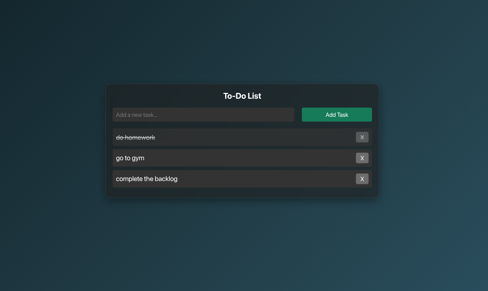

# 📝 To-Do List App

A simple and responsive **To-Do List** built using **HTML, CSS, and JavaScript**.  
This app allows users to add, complete, and delete tasks easily.

---

## 🚀 Features

- ➕ Add new tasks
- ✅ Mark tasks as completed
- ❌ Delete tasks
- 💾 Tasks stay visible until you refresh (no database yet)
- 🎨 Clean dark UI design
- With Local Storage as well

---

## 🖼️ Preview

  
_(Take a screenshot of your app, name it `screenshot.png`, and place it in the project folder for this to display.)_

---

## 🛠️ Technologies Used

- **HTML5**
- **CSS3** (Dark theme, responsive design)
- **JavaScript (ES6)**

---

## 📂 Project Structure

todo-list/
│── index.html
│── styles.css
│── script.js
└── README.md

---

## 📦 How to Run

1. Clone this repository:
   ```bash
   git clone https://github.com/your-username/todo-list.git
   ```
2. Navigate into the folder:

```bash
 cd todo-list
```

3. Open index.html in your browser.

🌟 Future Improvements

-adding backend support to it

-Add categories (Work, Personal, etc.)

-Add due dates & reminders

-Improve animations & UI design

This project is open-source and available under the MIT License
